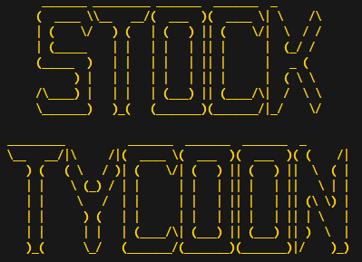

# Stock Tycoon

Stock Tycoon is a text based stocks drafting game. Players compete against AI to put together the most valuable portfolio!

### Rules

Stock Tycoon is played over 3 rounds. Each round you are given a pack of 15 stocks to choose from.
    
Enter the stock number you want to take. 
    
Every player will take a stock out of their pack, and then pass the pack on to the next player. This is repeated until there are no more stocks left in the packs.
    
Each new round the direction in which you pass the pack alternates. At the end of the 3 rounds, the player with the most valuable portfolio wins!

## How to play:

1. Launch the game via your command line terminal

        python stockTycoon.py

2. Enter your player name
3. Select a stock from your pack by entering the stock number
4. Repeat until all stocks have been chosen

## Requirements

- Python 3.7.0 and above
- The dependencies listed below installed
- PC / Mac compatible

## Dependencies

| Name | Description | Website |
|------|-------------|---------|
| pyFiglet | The game banner was produced by this libraries ASCII art features. |  https://github.com/SyntaxVoid/pyfiglet   http://www.figlet.org/ |
| rich | The colouring, tablular and text formatting features from this library were used to improve the text based graphics in this application. | https://github.com/Textualize/rich   https://rich.readthedocs.io/en/stable/introduction.html |

## Installation

1. Open a virtual environment

    In **WSL/Ubuntu**:

        source venv/bin/activate

2. Install the dependencies with pip or your preferred PyPI package manager.
    
        pip install rich
        pip install pyfiglet

## About

This repository contains the following scripts:

| Script | Description |
|--------|-------------|
| stockTycoon.py | This is the top level script. Execute this file to play the game. |
| stockTyGameEngine.py | This is the game engine, containing all the class templates that is imported into stockTycoon.py. |
| stockCatalogue.py | This is the list of all the stocks used in the game. To add variations to the game, alter this list with new stocks names and types. |
| botNames.py | Contains the premade list of names assigned to the bots when generating extra players in the game lobby. |